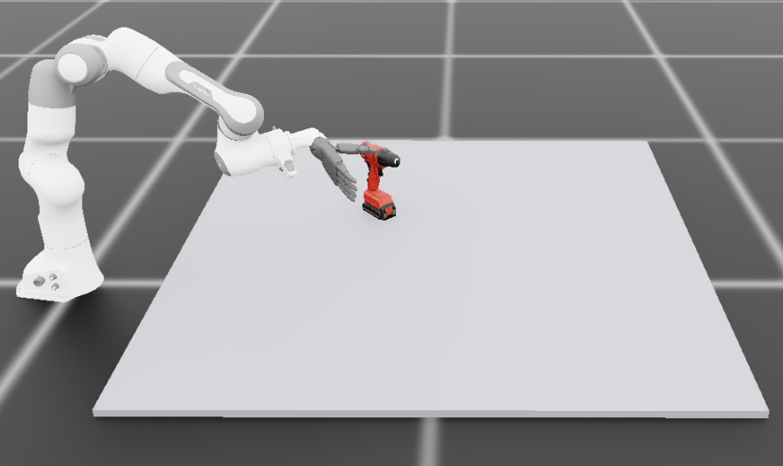
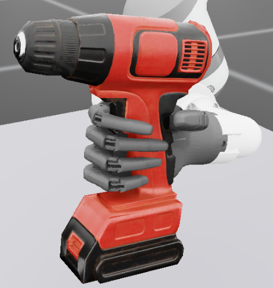
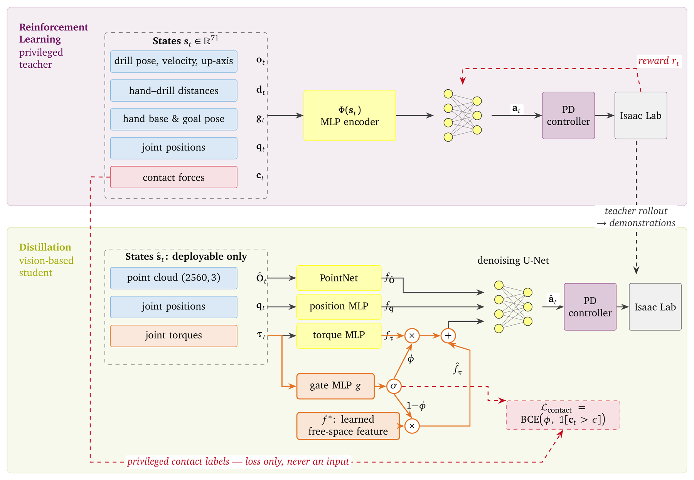
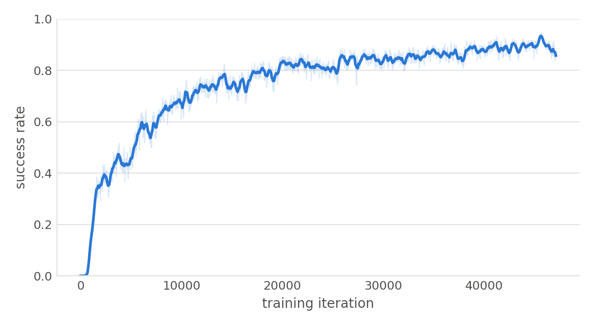
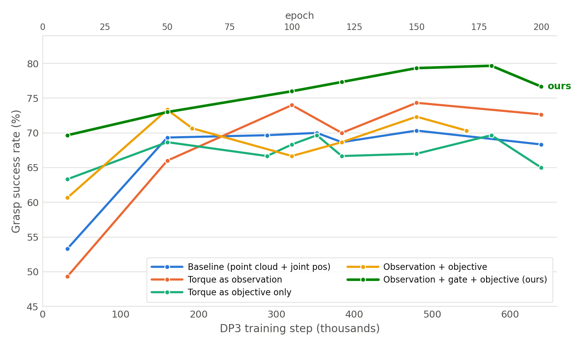
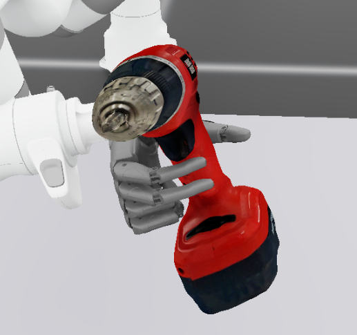
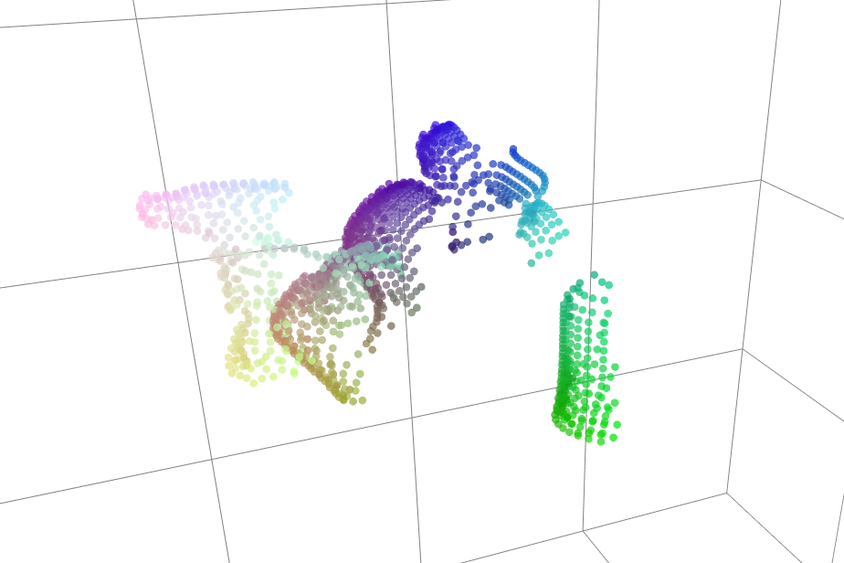
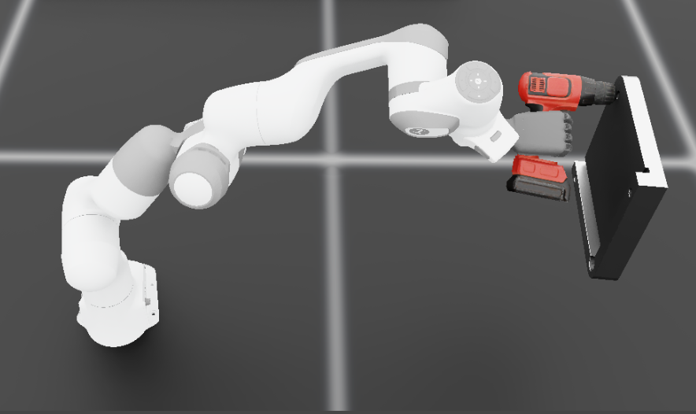
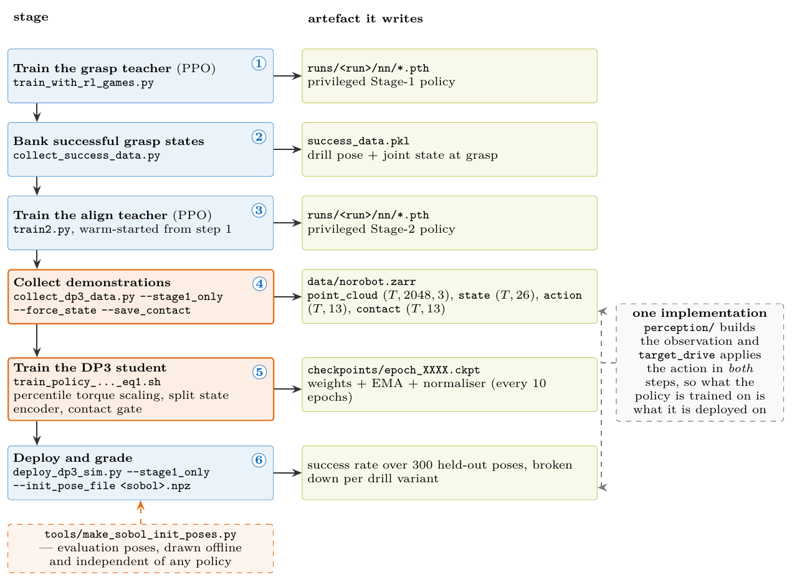

# Learning-based Functional Grasping for Dexterous Hands

**Master's thesis · Technical University of Munich (TUM)**<br>
Supervisors: Qian Feng, Zitao Zhang

Simulation environments, data pipeline and training/evaluation code for the thesis. The platform is built on Isaac Lab and targets a 13-DoF system: a 7-DoF Franka arm equipped with a 6-DoF Inspire five-finger hand.

<p align="center">
  
  
</p>
<p align="center"><sub>Left: the simulated platform. Right: what counts as success — the handle enclosed by a majority of the hand links <i>and</i> the index finger within reach of the trigger.</sub></p>

## Overview

A *functional* grasp is one that not only immobilises an object but acquires it in the configuration required to operate it. For a hand-held power tool this means the palm and thumb engage the handle, the index finger reaches the trigger, and the tool axis remains free to be aimed — a considerably narrower set of admissible hand–object configurations than force closure alone. This work formulates functional grasping of a power drill as a two-stage manipulation problem (grasp, then alignment of the drill towards a target) and studies which observations a deployable, vision-based policy actually requires in order to solve it.

Reinforcement learning solves the task reliably when the policy is granted privileged access to simulator state — exact object pose, per-link contact forces, and object velocities. None of these quantities are observable on hardware, so such a policy is not deployable. The pipeline therefore follows a **privileged-teacher / visuomotor-student distillation** scheme:

<p align="center"></p>

**Top:** the privileged teacher, trained with PPO on the 71-dimensional simulator state — drill pose, velocity and up-axis, hand–drill distances, hand-base and goal orientation, joint positions, and per-link contact forces — none of which a real robot can measure. **Bottom:** the student observes only what it can: a point cloud and joint proprioception, each embedded by its own branch. The torque branch passes through the contact gate, and the privileged contact labels (dashed red) reach the loss only — never the network input.


1. A privileged teacher is trained with PPO (rl_games) on full simulator state.
2. The teacher is rolled out and only hardware-observable quantities are recorded — a depth-camera point cloud and joint proprioception — paired with the joint targets the teacher executed.
3. A [3D Diffusion Policy](https://github.com/YanjieZe/3D-Diffusion-Policy) (DP3) student is trained on this dataset by behaviour cloning (sibling repository).
4. The student is deployed in the same environment and evaluated against a fixed set of initial object poses.

**Research question and experimental design.** The central question is which components of the observation are necessary for functional grasping, in particular whether proprioceptive force information contributes beyond geometry. The observation is therefore assembled from interchangeable segments: point-cloud composition (external fixed camera, wrist-mounted camera, forward-kinematics robot cloud, ground-truth handle segmentation channel), proprioception (joint positions alone versus joint positions with applied joint torques), and the contact-gated torque branch with its privileged supervision (detailed in the next section). Data collection and deployment share the same `perception/` implementation, so the observation remains the only controlled variable between two runs, and every checkpoint is evaluated on an identical, policy-independent Sobol pose set (`--init_pose_file`), which makes reported success rates directly comparable across ablations.

Generalisation across object geometry is assessed with three drill variants (`drill2`, `drill_blue`, `drill_yellow`) differing in shape, scale and handle geometry; all variants are trained jointly and success is reported per variant.

---

## Contribution: contact-gated joint torque as a proprioceptive modality

**Motivation — contact is not a geometric quantity.** Whether the index finger has arrived at the trigger, whether a finger is bearing load, and whether the tool is settling or slipping are *mechanical* states, not shapes. A point cloud reports where surfaces are, at a resolution and noise level comparable to the very quantity that separates a finger resting on the trigger from a finger a millimetre away from it. This is not a deficiency of a particular viewpoint that a better camera would fix — the information is not present in the geometry at all. Occlusion by the closing fingers compounds the problem without being its source, and the forward-kinematics robot cloud already restores most of the hand geometry the fixed camera loses to self-occlusion.

Joint torque is the one contact-revealing quantity the real platform already measures, requiring no additional sensor. It is not, however, an external-force reading: what this pipeline records is the **applied** joint torque, i.e. the effort the position controller spent tracking its command. In free motion that is tracking effort and carries no contact information; in contact the same channel additionally reflects the resistance of the grasped object. The channel is therefore informative about contact only *differentially*, against a state-dependent baseline — which is precisely why it cannot simply be concatenated to the state vector. That is the "feature concatenation" baseline, which prior work measures as indistinguishable from vision-only.

**Why raw torque fails.** In free space the measured joint torque is dominated by gravity and inertia rather than contact, so most of its variance encodes task phase, not interaction. Two further obstacles were quantified on the collected dataset:

- *Scale.* The empirical extrema of the torque channels are the actuator effort limits (±87 / ±40 / ±10 N·m), reached in ≤0.8 % of frames. Min–max normalisation therefore compresses 98 % of the data into roughly 12 % of the normalised range (σ = 0.106, against 0.522 for the action channels). Since the per-channel signal-to-noise ratio of a diffusion model at step *t* is SNR<sub>t</sub> = ᾱ<sub>t</sub>σ²/(1−ᾱ<sub>t</sub>), a five-fold smaller σ is a twenty-five-fold lower SNR: the torque channels drop below unit SNR at t ≈ 5 and are therefore indistinguishable from noise for roughly 95 % of training steps.
- *Structure.* The seven arm torque dimensions have about ten times the standard deviation of the finger dimensions and are gravity-dominated, so passing the full vector through a shared encoder propagates the noisiest channels while only cleaning the quiet ones.

**Method.** The proposed treatment has three components:

1. **Percentile normalisation of the torque block.** The torque channels are scaled by their p1/p99 quantiles instead of their extrema, raising σ to ≈ 0.44 — the same order as the action and joint-position channels. The ~2 % of saturation frames that then fall outside the normalised range are clamped inside the policy rather than in the dataset, so that training and deployment apply an identical transform (`task.dataset.torque_start` together with `policy.clamp_agent_pos`).
2. **Split state encoder.** Joint positions and joint torques are embedded by separate MLP branches before concatenation with the point-cloud feature, so that the force pathway can be modulated independently of the kinematic one (`policy.state_split`).
3. **Contact-gated force branch, supervised by privileged contact labels.** The gating mechanism itself is not new: the convex mix below follows Lei et al. (2026), which in turn follows [FoAR](https://arxiv.org/abs/2411.15753) (He et al., RA-L 2025). What differs here is **how the gate opening is obtained** — rather than thresholding a measured external torque, it is predicted from proprioception and supervised explicitly against the simulator's per-link contact forces, a label that a distillation pipeline gets for free and a real-robot-only pipeline does not have. A gate φ = σ(MLP(τ<sub>finger</sub>)) modulates the force branch, either at its input (τ<sub>in</sub> = φ·τ + (1−φ)·τ<sub>free</sub>) or at its output feature (f = φ·f<sub>torque</sub> + (1−φ)·f\*), where τ<sub>free</sub> and f\* are *learned* free-space embeddings, so that "not in contact" remains distinguishable from "in contact with zero net torque". Left to the diffusion objective alone such a gate collapses towards a constant — the failure mode reported for a learned mixture-of-experts router in prior work — so it is supervised explicitly by binary cross-entropy against privileged per-link contact forces recorded during collection. **The contact labels enter the loss only, never the network input**, so the deployed policy remains restricted to hardware-observable quantities.

**Design decisions, each grounded in a measurement on the collected data.** The gate is per-finger rather than a single global scalar, because 44 % of contact frames are partial contact (one to five fingers), and per-finger contact is predictable from the matching joint's torque at AUC 0.93–0.98 versus 0.67–0.75 from a global torque magnitude. The gate observes finger signals only: arm joint angles alone predict finger contact at AUC 0.857, a pure task-phase shortcut that carries no contact information and that the gate would otherwise learn in place of the physics. The arm torque dimensions are excluded from the branch entirely. Optionally, the thresholded 0/1 gate label is replaced by a graded target log(1+|F|)/log(1+c<sub>ref</sub>), since contact force spans more than a decade (in-contact p10 2.6–8.3 N, p50 14–29 N, p90 36–67 N) and a hard label collapses that range onto a single value.

**Ablation axes.** The corresponding configurations are selected on the collection side and in the student's task/policy configuration:

| Condition | Data flags (`collect_dp3_data.py`) | Student configuration |
|---|---|---|
| Vision + joint positions (baseline) | — | `agent_pos` 13-d |
| + raw joint torque | `--force_state` | `agent_pos` 26-d, `state_split` |
| + percentile torque normalisation | `--force_state` | `task.dataset.torque_start=13`, `policy.clamp_agent_pos=true` |
| + contact gate | `--force_state --save_contact` | `policy.contact_gate.enabled=true`, `scope=per_finger\|global`, `gate_position=input\|feature`, `soft_label=true\|false` |
| Torque as auxiliary objective only | `--force_state` | `policy.state_obs_dim=13` (+ `policy.aux_torque`): torque supervises the predicted trajectory but is withheld from the encoder |

Every condition is trained from the same demonstrations and evaluated with the protocol described below, so that differences in success rate are attributable to the observation and its treatment alone.

---

## Task formulation

The problem is decomposed into two stages, each realised as a separate Isaac Lab environment:

| | **Stage 1 — functional grasp** | **Stage 2 — alignment** |
|---|---|---|
| env | `tasks/grasp_drill_env.py` (`GraspDrillEnv`) | `tasks/stage2_env.py` (`Stage2Env`) |
| initial state | drill resting on the table at a randomised pose | drill **already grasped** (reset from recorded successful grasp end-states) |
| objective | lift and hold the drill with the index finger at the trigger and the thumb at the variant-specific handle contact point | bring the grasped drill to a target orientation in front of the plate |
| success | drill held in the target configuration for ≥20 of the last 50 steps | alignment maintained for `--success_hold_stop` consecutive steps |

Stage 1 is where functionality is enforced: the reward shapes the fingertip–trigger and thumb–handle distances under an orientation gate, so a grasp that is stable but does not afford operation of the tool is not rewarded. Stage 2 verifies functionality downstream, since only a correctly acquired drill can be aimed at the target.

`tasks/chained_env.py` (`ChainedEnv`) executes both stages within a single episode, starting in phase 0 (grasp) and switching to phase 1 (alignment) once the grasp criterion is met. The flag `--stage1_only` uses the same environment but terminates at the switching point; this grasp-only setting is used for the majority of the student experiments reported here.

---

## Results

All numbers are in simulation, on a fixed set of **300 held-out initial poses** (a Sobol set, generated without a simulator and replayed pose-for-pose) shared by every checkpoint, so rows are directly comparable. Success requires envelopment *and* trigger reachability, held jointly for at least 20 of the last 50 control steps.

### Teacher, and what distillation costs

| Policy | Observation | Success |
|---|---|---|
| Stage-1 teacher (grasp) | privileged state (71-d) | **93.0 %** |
| Stage-2 teacher (align) | privileged state + plate pose | **92.0 %** |
| Grasp **student** (ours) | point cloud + proprioception | **79.7 %** |

<p align="center"></p>

### Torque ablation

The two roles torque can play — as an **observation** entering the conditioning, and as an **auxiliary prediction target** that never reaches the input — are crossed, plus the contact gate on top of the observation:

| Configuration | Obs. | Target | Gate | Success | Best epoch |
|---|:--:|:--:|:--:|--:|--:|
| Baseline — point cloud + joint positions | | | | 70.3 % | 150 |
| Torque as observation | ✓ | | | 74.3 % | 150 |
| Torque as objective only | | ✓ | | 69.7 % | 110 |
| Observation + objective | ✓ | ✓ | | 73.3 % | 50 |
| Observation + **gate** | ✓ | | ✓ | 78.3 % | 100 |
| **Observation + gate + objective (ours)** | ✓ | ✓ | ✓ | **79.7 %** | 180 |

<p align="center"></p>

**What the table says, read additively.** Torque supplied as a plain observation is worth about +4 points (70.3 → 74.3). Gating that same observation is worth another +4 (74.3 → 78.3) — the gate contributes as much as the channel it gates, which is the central result: the signal is more useful as the *supervisory target of a gate* than as a direct input.

**What the table does not say.** The auxiliary objective does not carry its weight here. Alone it leaves the rate at 69.7 % against a 70.3 % baseline, and on top of the gated observation it moves 78.3 % → 79.7 %, within the resolution of a 300-episode evaluation. This replicates Lei et al. (2026) rather than TA-VLA, and we do not claim the auxiliary term is what produces the gain — it is reported as part of the proposed configuration because it is the best checkpoint observed, not because the increment is established.

### Dataset

Collection runs to a fixed budget of attempts, not to a target size: 1000 episodes per drill variant, and only episodes meeting the success criterion are written out.

| | Grasp | Alignment |
|---|--:|--:|
| Collection attempts | 3000 | 3000 |
| Successful episodes retained | 2614 | 3000 |
| Transitions (30 Hz control steps) | 435,781 | 473,711 |
| Mean episode length | 166.7 | 157.9 |

With a 2 % per-episode validation split the grasp set yields 409,516 training windows, while one epoch is 3200 optimizer steps × batch 128 = 409,600 samples — so **one epoch is almost exactly one pass over the training set**, and "200 epochs" means 200 passes over ~2600 demonstrations.

### Generalisation to unseen drills

On drill geometries held out from training the hand still encloses the handle, but the *functional* condition frequently fails: the trigger offsets are specified per variant in the object frame, so they do not transfer. Regressing them from the observed point cloud (an affordance or keypoint head) is the obvious next step.

<p align="center">
  
  
</p>
<p align="center"><sub>Left: the characteristic unseen-geometry failure — a secure hold that is not a functional one. Right: the student's actual input, a 2048-point single-view camera cloud fused with a 512-point forward-kinematics hand cloud.</sub></p>

### Stage 2 — alignment as a stress test

The alignment stage is an *auxiliary* task: carrying the drill to a plate and holding it to centimetre accuracy stresses a grasp in a way a static configuration check does not.

<p align="center"></p>

---

## Installation

`scripts/` runs inside the **Isaac Lab Python environment**; the DP3 student trains in a **separate** env (its dependencies conflict with Isaac Sim's).

### 1. Isaac Sim + Isaac Lab

Full instructions: <https://isaac-sim.github.io/IsaacLab/main/source/setup/installation/pip_installation.html>

```bash
conda create -n env_isaaclab python=3.11
conda activate env_isaaclab
pip install --upgrade pip

# Isaac Sim
pip install "isaacsim[all,extscache]==5.1.0" --extra-index-url https://pypi.nvidia.com

# PyTorch (CUDA 12.8, x86_64)
pip install -U torch==2.7.0 torchvision==0.22.0 --index-url https://download.pytorch.org/whl/cu128

# Isaac Lab
git clone https://github.com/isaac-sim/IsaacLab.git --branch main
cd IsaacLab
./isaaclab.sh --install
```

Verify with `python -c "import isaaclab; print(isaaclab.__version__)"`. This repo is developed against **Python 3.11 / isaaclab 0.53.1**.

### 2. Extra packages in the Isaac Lab env

```bash
pip install rl_games==1.6.1 zarr numcodecs dill omegaconf trimesh
```

`rl_games` is the PPO backend · `zarr`/`numcodecs` write the DP3 dataset · `dill`/`omegaconf` load DP3 checkpoints at deploy time · `trimesh` is only needed by `tools/build_robot_pointcloud.py`.

### 3. DP3 student environment (separate)

Clone [3D-Diffusion-Policy](https://github.com/YanjieZe/3D-Diffusion-Policy) next to this repo and follow its install. Developed against:

```
Python 3.8 · torch 2.4.1 (cu124) · diffusers 0.36 · zarr 2.16 · hydra-core 1.3.2
```

### 4. Assets

USD files for the drills / robot / plate go in `assets/` (gitignored). The canonical robot point cloud is a one-off build:

```bash
python tools/build_robot_pointcloud.py     # -> assets/inspire_tac/robot_canonical_points.npz
```

`data/`, `collected_data/`, `runs/` and `output/` are gitignored as well.

---

## Scripts

Six stages produce every number in this repository. Each box names the script that performs it and the artefact it writes:

<p align="center"></p>


### Training the RL teachers (privileged state, PPO via rl_games)

| script | trains | notes |
|---|---|---|
| `scripts/train_with_rl_games.py` | **Task 1 (grasp)** | `--num_envs 256 --headless`, resume with `--checkpoint`, config `config/agents/rl_games_ppo_cfg.yaml` |
| `scripts/collect_success_data.py` | — | banks successful grasp end-states into a pkl; Task 2 resets from it |
| `scripts/train2.py` | **Task 2 (align)** | `--dataset collected_data/success_data.pkl`, `--num_envs 4096`, target pose via `--target_pos/--target_quat` |

```bash
# Task 1
python scripts/train_with_rl_games.py --headless --num_envs 256

# grasp end-states for Task 2
python scripts/collect_success_data.py --headless --num_envs 2048 \
    --checkpoint runs/<stage1_run>/nn/<stage1_run>.pth \
    --output collected_data/success_data.pkl

# Task 2
python scripts/train2.py --headless --num_envs 4096 \
    --dataset collected_data/success_data.pkl
```

Checkpoints land in `runs/<run_name>/nn/*.pth`.

### Deploying the privileged RL policy (state observations, no cameras)

| script | runs |
|---|---|
| `scripts/play_drill.py` | Task 1 teacher alone, on screen |
| `scripts/play_stage2.py` | Task 2 teacher alone, resets from `--success_dataset` |
| `scripts/play_chained.py` | both teachers chained in one episode (`--stage1_checkpoint` + `--stage2_checkpoint`) |
| `scripts/deploy_dp3_sim.py --policy rl` | the teacher inside the **DP3 evaluation loop** — same env, same init poses, same success counting, so the number is directly comparable to a student's |

```bash
python scripts/play_drill.py   --num_envs 4 --checkpoint runs/<stage1_run>/nn/<x>.pth --real_time
python scripts/play_stage2.py  --num_envs 8 --checkpoint runs/<stage2_run>/nn/<x>.pth
python scripts/play_chained.py --num_envs 3 \
    --stage1_checkpoint runs/<stage1_run>/nn/<x>.pth \
    --stage2_checkpoint runs/<stage2_run>/nn/<x>.pth

# teacher measured in the student's eval harness
python scripts/deploy_dp3_sim.py --policy rl --stage1_only --headless --num_envs 70 \
    --stage1_checkpoint runs/<stage1_run>/nn/<x>.pth \
    --init_pose_file data/eval_sobol_100_pos010.npz
```

### DP3 student: collection, training, deployment

| script | does |
|---|---|
| `scripts/collect_dp3_data.py` | rolls out the RL teacher and writes a DP3 zarr (point cloud + joint state + executed joint targets) |
| `tools/make_sobol_init_poses.py` | generates a policy-independent Sobol eval pose set (no simulator needed) |
| `scripts/deploy_dp3_sim.py` | runs / evaluates a trained DP3 checkpoint in the same env |

**Collect** (grasp task, fixed camera only, no robot-FK segment, with joint torques and contact labels):

```bash
python scripts/collect_dp3_data.py --stage1_only --headless \
    --num_envs 64 --episodes_per_variant 1000 \
    --disable_cam2 --no_robot --force_state --save_contact \
    --stage1_checkpoint runs/<stage1_run>/nn/<x>.pth \
    --output data/norobot.zarr
```

Only successful episodes are written. One row = the observation at decision time plus the joint target `q*` executed that step:

```
data/point_cloud  (T, N, 3)   env-local fused cloud
data/state        (T, 13|26)  joint pos [| applied torque]
data/action       (T, 13)     joint targets q*
data/contact      (T, 13)     per-link contact force (privileged training label)
meta/episode_ends (E,)
```

**Train the student** in the sibling repo, with a task yaml whose `shape_meta` matches the zarr:

```bash
cd ../3D-Diffusion-Policy/3D-Diffusion-Policy
python train.py --config-name=simple_dp3.yaml \
    task=inspire_drill_grasp_norobot_contact \
    task.dataset.zarr_path=[/home/zeyu/inspire_drill/data/norobot.zarr]
```

**Deploy / evaluate**:

```bash
python scripts/deploy_dp3_sim.py --stage1_only --headless --num_envs 70 \
    --dp3_ckpt <run>/checkpoints/epoch_0150.ckpt \
    --disable_cam2 --no_robot \
    --init_pose_file data/eval_sobol_100_pos010.npz
```

`--init_pose_file` replays a fixed pose set, each pose exactly once, so different checkpoints are graded on identical initial conditions; success is printed overall and per drill variant.

Other modes of the same script:

- `--stage2_only` — align task only, drill starts already grasped from `--success_dataset`
- `--stage2_dp3_ckpt` — two-stage student: the grasp checkpoint hands off to the align checkpoint
- `--stage2_rl` — grasp by DP3, align by the privileged teacher (upper bound on what the hand-off supports)
- `--dual` — student and teacher on the same trajectory, logging the per-step action difference
- `--collect_success_data` — like `collect_success_data.py`, but with DP3 driving the grasp
- `--dump_obs_zarr` — record what the deployed policy actually sees, in the collection layout, for a 1:1 diff against the training data

---

## Important: collect and deploy must agree

The observation is built by the same `perception/` code on both sides, but its **composition is chosen by flags**. A mismatch is silent — the policy simply sees something it was never trained on. Only the point-cloud *size* is checked against the checkpoint at startup.

| Flag | Effect |
|------|--------|
| `--disable_cam2` | camera segment = fixed cam1 alone (2048 pts) instead of cam1 + wrist cam |
| `--no_robot` | drop the robot FK segment |
| `--robot_pc_points` / `--robot_pc_per_link` / `--robot_pc_hand_only` | robot segment size and which links it covers |
| `--ground_points` | synthetic ground segment |
| `--force_state` (collect) | `agent_pos` is 26-d `[joint pos \| applied torque]` instead of 13-d |
| `--mask_threshold` | is-handle radius, i.e. the definition of the 4th point-cloud channel |
| `--stage1_only` / `--chained` / `--stage2_only` | which env, which cameras, and the success criterion |

`agent_pos` dimension and point-cloud channel count are read back from the checkpoint config at deploy time, so those two need not be passed again.

---

## Layout

```
tasks/          Isaac Lab environments
  grasp_drill_env.py    Task 1: grasp (DirectRLEnv — scene, obs, reward, termination)
  stage2_env.py         Task 2: align, resets into an already-grasped state
  chained_env.py        Task 1 -> Task 2 in one episode (and --stage1_only)
  config/config.py      all hyperparameters (scene, randomization, perception)

perception/     observation construction, shared byte-for-byte by collect and deploy
  dp3_pointcloud.py     camera depth -> cropped fixed-size point cloud
  robot_pointcloud.py   robot FK point cloud + synthetic ground
  student_obs.py        agent_pos = joint pos (13) [| applied torque (13)]
  target_drive.py       direct joint-target drive; raw action <-> q* conversion
  groundtruth_mask.py   GT is-handle label for the optional 4th channel

scripts/        training / play / collect / deploy (see above)
tools/          one-off offline utilities
config/         drill variants, drill config, rl_games agent configs
```

---

## References

- Ze et al., **3D Diffusion Policy**, RSS 2024 — the student architecture ([repo](https://github.com/YanjieZe/3D-Diffusion-Policy))
- Lei, Liu, She, Liang, Zheng, **Learning When to See and When to Feel: Adaptive Vision-Torque Fusion for Contact-Aware Manipulation**, arXiv:2604.01414, 2026 — the contact-gated torque branch adopted here, and the finding that suppressing torque during free motion carries most of the benefit
- He, Fang, Chen, Fang, Lu, **FoAR: Force-Aware Reactive Policy for Contact-Rich Robotic Manipulation**, IEEE RA-L 2025 — the origin of the gating formulation
- Zhang et al., **TA-VLA**, arXiv:2509.07962, 2025 — the observation / auxiliary-target distinction

## Citation

```
@mastersthesis{xu2026functional,
  title  = {Learning-based Functional Grasping for Dexterous Hands},
  author = {Xu, Zeyu},
  school = {Technical University of Munich},
  year   = {2026}
}
```
